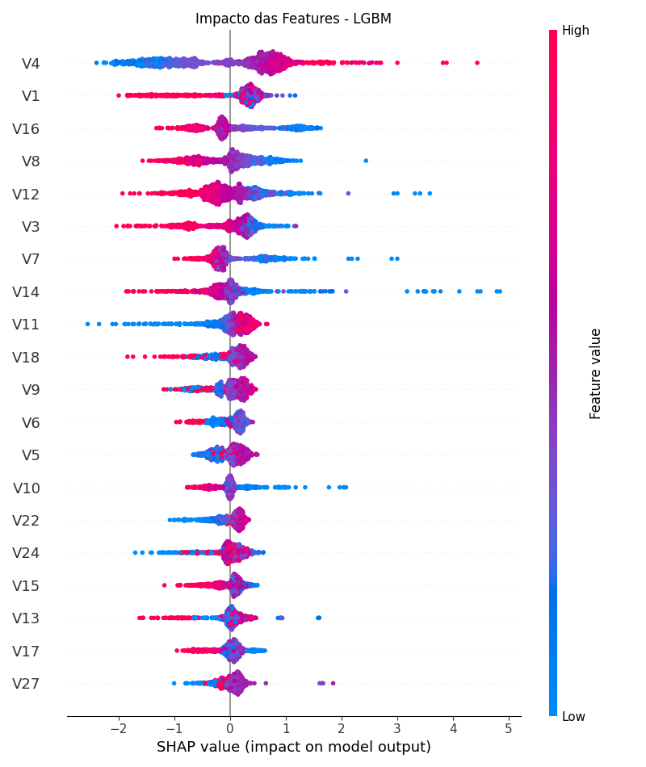
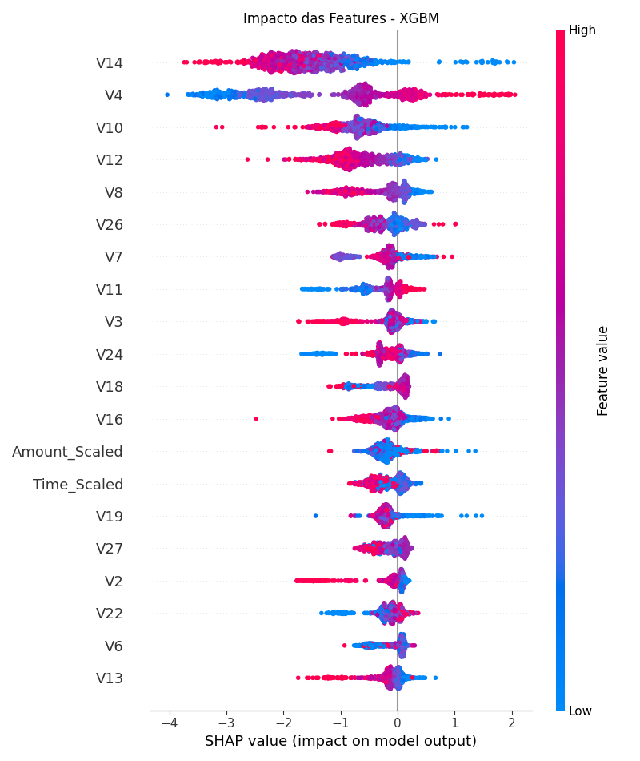

# 🛡️ Detecção de Fraudes em Transações Financeiras


Este projeto implementa uma solução de Machine Learning de alta performance para a detecção de fraudes em cartões de crédito. O sistema utiliza uma arquitetura de **Ensemble Learning** combinando **LightGBM** e **XGBoost**, otimizados para maximizar a métrica **ROC AUC** em cenários de extremo desbalanceamento de classes.

---

## 📂 Estrutura do Projeto

O projeto segue as boas práticas de Engenharia de Machine Learning, segregando dados, processamento e modelagem:

```text
fraud-detection/
│
├── data/                   # Diretório para armazenamento dos dados brutos (ignorado pelo Git)
│   ├── train.csv           # Dataset de treino
│   └── test.csv            # Dataset de teste (sem target)
│
├── models/                 # Artefatos serializados dos modelos treinados
│   ├── lgbm_model.pkl      # Modelo LightGBM final
│   └── xgboost_model.pkl   # Modelo XGBoost final
│
├── src/                    # Código fonte modularizado
│   ├── preprocessing.py    # Pipelines de limpeza e engenharia de features
│   └── training.py         # Lógica de treinamento, validação cruzada e ensemble
│
├── main.py                 # Orquestrador principal da execução
├── requirements.txt        # Dependências do projeto com versões travadas
└── README.md               # Documentação oficial
```

## 🚀 Guia de Instalação e Execução
Siga os passos abaixo para reproduzir os resultados em seu ambiente local.

### **1. Pré-requisitos**

Certifique-se de ter o Python 3.8+ instalado. Recomenda-se o uso de um ambiente virtual (venv).

### **2. Instalação das Dependências**

Clone este repositório e instale as bibliotecas necessárias:

```bash
pip install -r requirements.txt
```

*Nota: As versões das bibliotecas foram fixadas para garantir a reprodutibilidade exata dos resultados.*

### **3. Configuração dos Dados**

Devido o tamanho, os dados não estão no repositório.

Baixe os arquivos `train.csv` e `test.csv` da competição no [Kaggle](https://www.kaggle.com/competitions/ligia-machine-learning/data).

Crie uma pasta chamada `data` na raiz do projeto.

Mova os arquivos `.csv` para dentro da pasta `data`.

### **4. Executando o Pipeline**

Para rodar o processo completo, execute o arquivo principal:

```bash
python main.py
```
### **O que o script fará:**

Carregará os dados e aplicará normalização (RobustScaler) e engenharia temporal.

Treinará os modelos LightGBM e XGBoost com Validação Cruzada Estratificada (5 Folds).

Salvará os modelos treinados na pasta `models`.

Gerará o arquivo `submission.csv` na raiz do projeto.

## 📊 Performance e Resultados

A solução foi avaliada utilizando a métrica **ROC** **AUC**.

| Ambiente | Score (AUC) |
| --- | --- |
| Validação local | ~0.9653
| Kaggle | 0.9846

### **Destaques da Metodologia:**

**Seed 42:** Fixada em todas as bibliotecas para garantir determinismo.

**Feature Engineering:** Transformação da variável Time em "Hora do Dia" para capturar padrões temporais de fraude.

**Tratamento de Desbalanceamento:** Uso de `is_unbalance=True` (LGBM) e `scale_pos_weight` (XGBoost) em vez de resampling artificial, preservando a distribuição original dos dados.

## 🧠 Interpretabilidade e Análise Crítica (SHAP)

Utilizamos a biblioteca **SHAP (SHapley Additive exPlanations)** para abrir a "caixa-preta" dos modelos e entender os fatores de decisão. A análise comparativa revelou que o LightGBM e o XGBoost "olham" para os dados de formas distintas, o que justifica a alta performance do Ensemble.

### **1. LightGBM: Agressividade e Foco Estrutural**


O LightGBM demonstrou um comportamento mais concentrado e agressivo:
* **Dominância da Feature V4:** É a variável soberana no modelo, com amplitude de impacto SHAP muito alta (de -2 a +5). Valores altos em `V4` (pontos vermelhos) indicam forte probabilidade de fraude.
* **Alta Não-Linearidade:** O modelo depende drasticamente de poucas variáveis (`V4`, `V1`, `V16`) para tomar decisões, ignorando quase totalmente o contexto de `Amount` (valor) e `Time`.
* **Risco:** Apresenta maior sensibilidade a outliers nessas features específicas.

### **2. XGBoost: Estabilidade e Contexto**


O XGBoost apresentou uma distribuição de importância mais equilibrada e robusta:
* **Dominância da Feature V14:** Diferente do LGBM, aqui a feature `V14` é o principal discriminador. Valores baixos (pontos azuis) aumentam drasticamente o risco de fraude.
* **Uso de Contexto (Amount & Time):** Ao contrário do LGBM, o XGBoost considerou `Amount_Scaled` e `Time_Scaled` como variáveis relevantes. Isso significa que ele consegue detectar fraudes baseadas no valor da transação e no horário, não apenas em padrões matemáticos abstratos (V's).
* **Estabilidade:** A amplitude dos valores SHAP é menor (~2), sugerindo um modelo menos propenso a overfitting extremo.

### **3. Limitações e Trade-off de Negócio**
Embora o modelo minimize Falsos Negativos (deixando passar poucas fraudes), a agressividade do LightGBM em features como `V4` pode gerar alguns **Falsos Positivos** (bloqueio de clientes legítimos). Em um cenário real de produção, recomenda-se uma camada humana de revisão para scores limítrofes (entre 0.7 e 0.9) para evitar atrito com o cliente.

### **4. Conclusão: O Poder da Complementaridade**
A análise SHAP explica o porquê a solução atingiu **AUC 0.9846**:

> **Hipótese Confirmada:** Existe uma **complementaridade estrutural**. Onde o LightGBM é agressivo e focado na feature `V4`, o XGBoost traz equilíbrio focando em `V14` e adicionando o contexto de `Amount` e `Time`. O Ensemble combina o melhor desses dois mundos, cobrindo os "pontos cegos" individuais de cada algoritmo.

## 👤 Autor
Luis Miguel de Almeida Lima
* LinkedIn: [Luis Miguel Lima](https://www.linkedin.com/in/luis-miguel-lima-b10684379/)
* GitHub: [luismiguuel](https://github.com/luismiguuel)